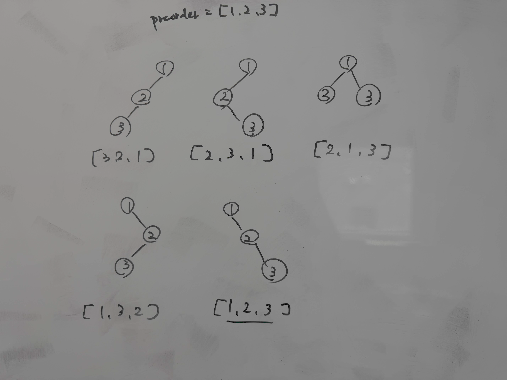

# step1 何も見ずに解く

preorder = [1, 2, 3]の場合の例を考えた。
inorderは以下のようになる



ここからどうするか考えて30分経ったので答えを見た

```ruby
# Definition for a binary tree node.
# class TreeNode
#     attr_accessor :val, :left, :right
#     def initialize(val = 0, left = nil, right = nil)
#         @val = val
#         @left = left
#         @right = right
#     end
# end
# @param {Integer[]} preorder
# @param {Integer[]} inorder
# @return {TreeNode}
def build_tree(preorder, inorder)
    inorder_val_to_index = {}
    inorder.each_with_index do |val, index|
        inorder_val_to_index[val] = index
    end
    
    build_tree_helper = -> (left_index, right_index) {
        preorder_index = 0
        build = -> (left_index, right_index) {
            return nil unless left_index < right_index

            root_val = preorder[preorder_index]
            root = TreeNode.new(root_val)
            preorder_index += 1
            root_val_index_in_inorder = inorder_val_to_index[root_val]
            root.left = build.call(left_index, root_val_index_in_inorder)
            root.right = build.call(root_val_index_in_inorder + 1, right_index)
            root
        }
        build.call(left_index, right_index)
    }
    build_tree_helper.call(0, preorder.size)
end
```

上のような、preorder_indexを再帰処理の外側で管理する方法がいまいちしっくりこなかった。

preorderは[root, (left_nodes), (right_nodes)]
inorderは[(left_nodes), root, (right_nodes)]
という順番になる。
preorderでのrootの隣がleft_nodesの再帰でのrootになるし、
preorderでrootにinorderのleft_nodesの数を足したものがright_nodesでのrootになるので、その値をそのまま使えば良いと思った。

```ruby
# Definition for a binary tree node.
# class TreeNode
#     attr_accessor :val, :left, :right
#     def initialize(val = 0, left = nil, right = nil)
#         @val = val
#         @left = left
#         @right = right
#     end
# end
# @param {Integer[]} preorder
# @param {Integer[]} inorder
# @return {TreeNode}
def build_tree(preorder, inorder)
    inorder_val_to_index = {}
    inorder.each_with_index do |val, index|
        inorder_val_to_index[val] = index
    end

    build_tree_helper = -> (left_index, right_index, root_val_index_in_preorder) {
        return nil unless left_index < right_index

        root_val = preorder[root_val_index_in_preorder]
        root = TreeNode.new(root_val)
        root_val_index_in_inorder = inorder_val_to_index[root_val]
        root.left = build_tree_helper.call(left_index, root_val_index_in_inorder, root_val_index_in_preorder + 1)
        root.right = build_tree_helper.call(root_val_index_in_inorder + 1, right_index, root_val_index_in_preorder + (root_val_index_in_inorder - left_index) + 1)
        root
    }
    build_tree_helper.call(0, preorder.size, 0)
end
```

時間計算量はO(N)で空間計算量もO(N)
Nの最大値が3000なので1秒以内に終わる。
stackの最大の深さも3000なのでRubyのデフォルトでstack overflowは起きない。
