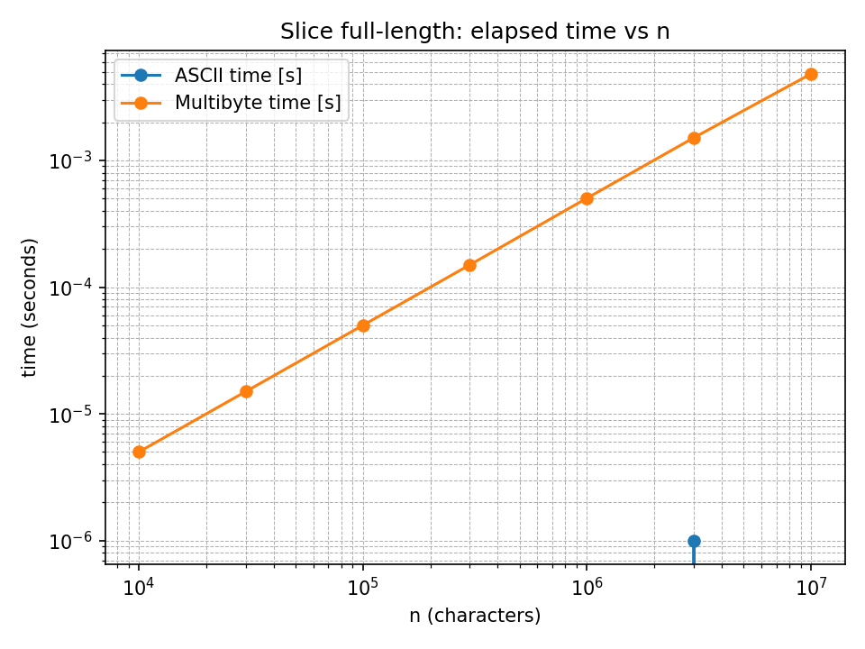

# step1 何も見ずに解く

上司から文字列を受け取る。`word_dict`を舐めて文字列の先頭が一致しているかどうか確認する。
一致していれば、残りの文字列に関して部下に聞く。

word_dict: ["aa", "a"]
string: "a"*n + "b"
のようなパターンの場合、メモ化をしないフィボナッチ数の再帰による計算と同様に計算量が爆発する。
枝刈りをして以下のようにした。
strの長さをN,word_dictのサイズをW、それぞれの長さをLとすると
時間計算量はO(N * W * L)
N,W,Lそれぞれ最大値は300, 1000, 20なので1秒以内に間に合いそう。
空間計算量はO(N)
再帰の深さは最大で、Nの最大値は300なのでRubyのデフォルトの設定でstackoverflowは起きない。
今回は引数をに文字列をそのまま入れているが、インデックスでもかける。

あとはDPでも解ける。

```ruby
# @param {String} str
# @param {String[]} word_dict
# @return {Boolean}
def word_break(str, word_dict)
    word_to_segmented = {}
    word_break_helper = -> (str) {
        return true if str.empty?
        return false if word_to_segmented[str] == false

        word_dict.each do |word|
            next unless str.start_with?(word)
            return true if word_break_helper.call(str[(word.size)..-1])
        end
        word_to_segmented[str] = false
        false
    }
    word_break_helper.call(str)
end
```

後から文字列のスライスのコストを考慮してなかったことに気づいた。
文字列のスライスコストを入れるとN * W * (L + N)なのでL * N^2になる。そうなるとRubyでギリギリかもしれないが、LeetCode上では想定以上に速い気がする。

Rubyのスライスメソッドを見たところ、ASCII文字列のスライスはO(1)であるが、マルチバイト文字列のスライスはO(N)らしい。
ベンチマークを取ってみると大きな差が出た。

```ruby
require 'benchmark'

n = 10 ** 7
ascii = "a" * n
multibyte = "あ" * n
Benchmark.bm do |x|
  x.report("ASCII") do
    ascii[0..(n - 1)]
  end
  x.report("multibyte") do
    multibyte[0..(n - 1)]
  end
end
```

```
               user     system      total        real
ASCII      0.000005   0.000001   0.000006 (  0.000003)
multibyte  0.004765   0.000155   0.004920 (  0.004920)
```

確かにマルチバイト文字列のスライスの時間は線形に伸びている。スライスだけではなくマルチバイト文字のインデックスへのアクセスもO(N)っぽい。



